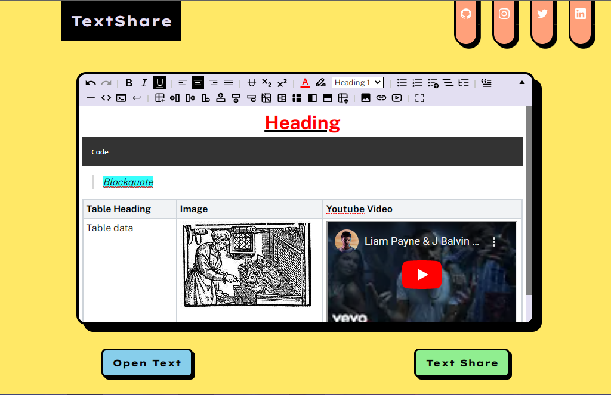
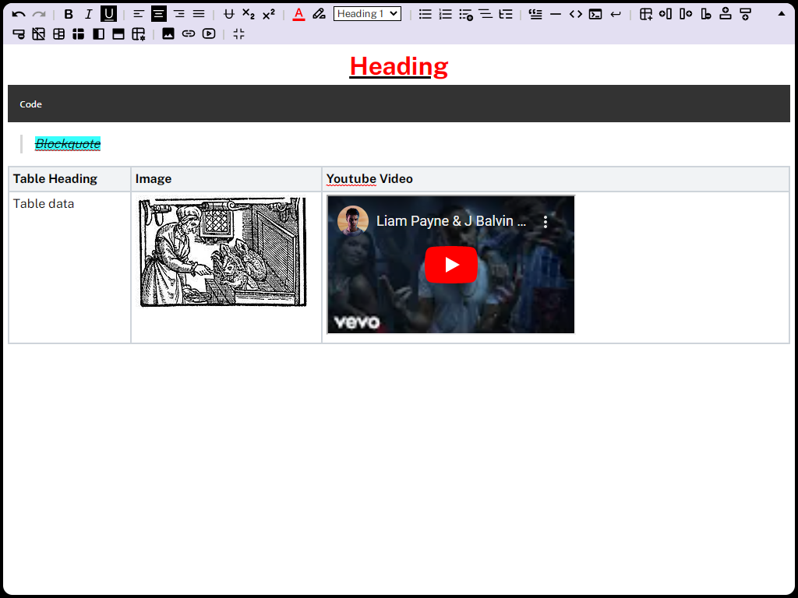
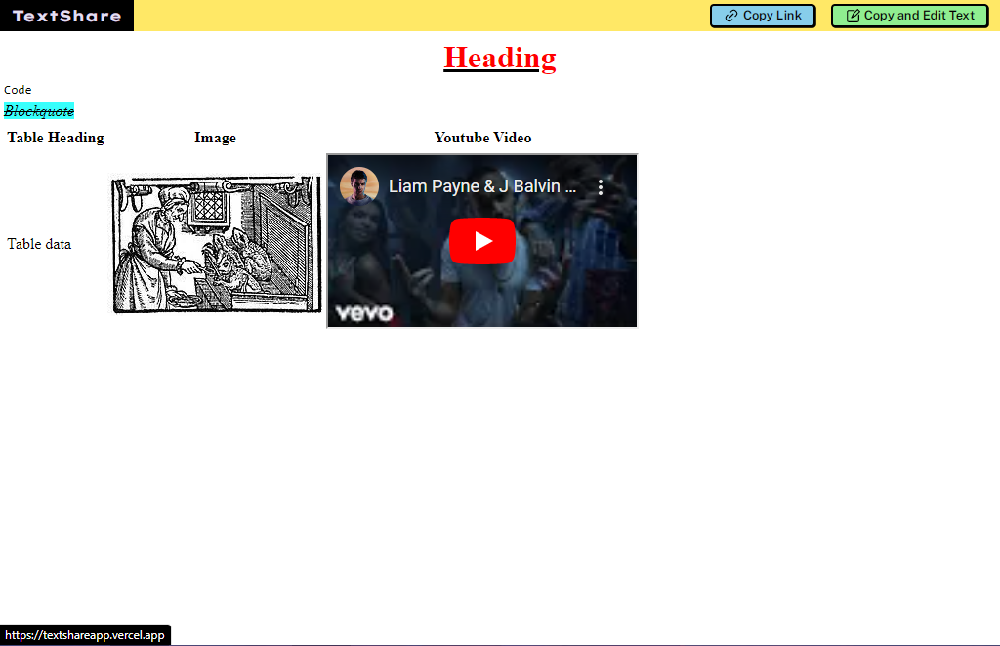

# TextShare

TextShare, a Text Sharing website with full-fledged rich text editor built using Next.js, Redis, Vercel and Github. It provides users with a familiar UI, Toggleable full screen(just the editor) and with just two clicks you can share your text to anyone you want.

## 🚀 Features

- Full Fledged Rich Text Edior
- Familiar UI
- Full Screen(Just the editor)
- 2 Click Text Sharing

## 📚 Installation

1. Clone the repository:

```bash
git clone https://github.com/shivamchhapola/TextShare.git
```

2. Navigate to the project directory:

```bash
cd TextShare
```

3. Install the dependencies using npm or yarn:

```bash
npm install
```

4. Configure the environment variables:
   Rename the .env.example file to .env.
   Update the necessary environment variables.

5. Start the development server:

```bash
npm run dev
```

6. Open your browser and visit http://localhost:3000

## 🛠️ Technologies Used

- Next.JS
- Redis
- Vercel
- Github

## 💡 Contributing

Contributions are welcome! If you have any suggestions, improvements, or bug fixes, please open an issue or submit a pull request.

## 📝 License

This project is licensed under the [MIT License](LICENSE).

## ⬛ Screenshots

- Homepage


- Fullscreen Editor


- Read/Open Text

